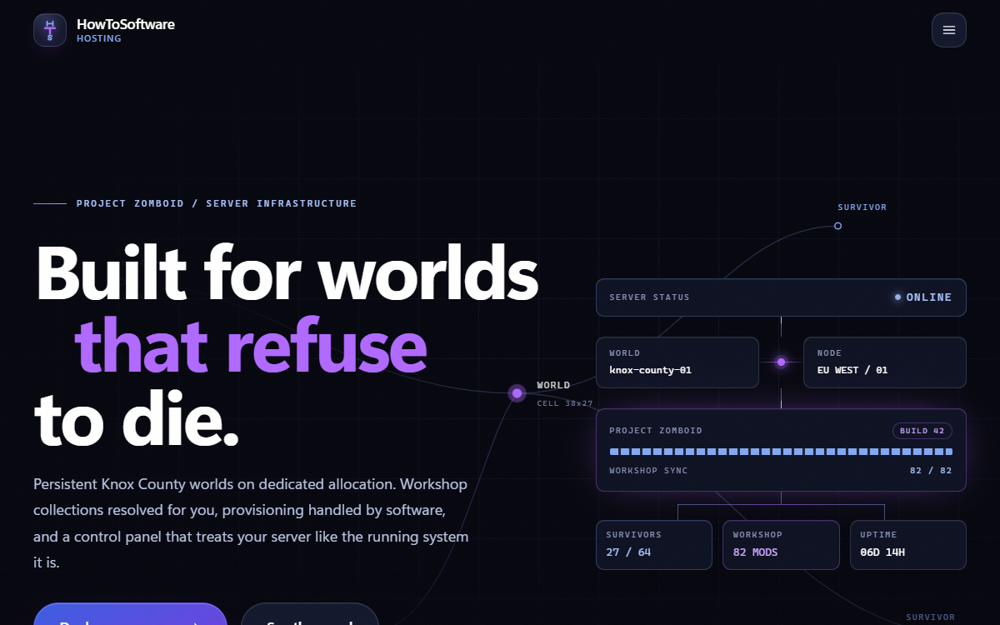
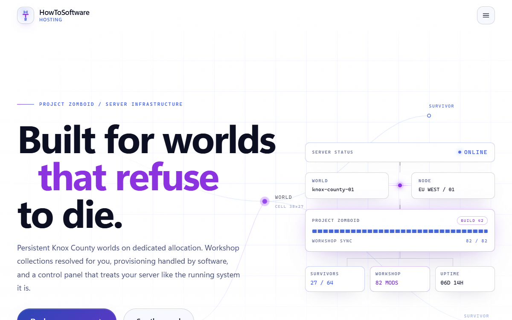
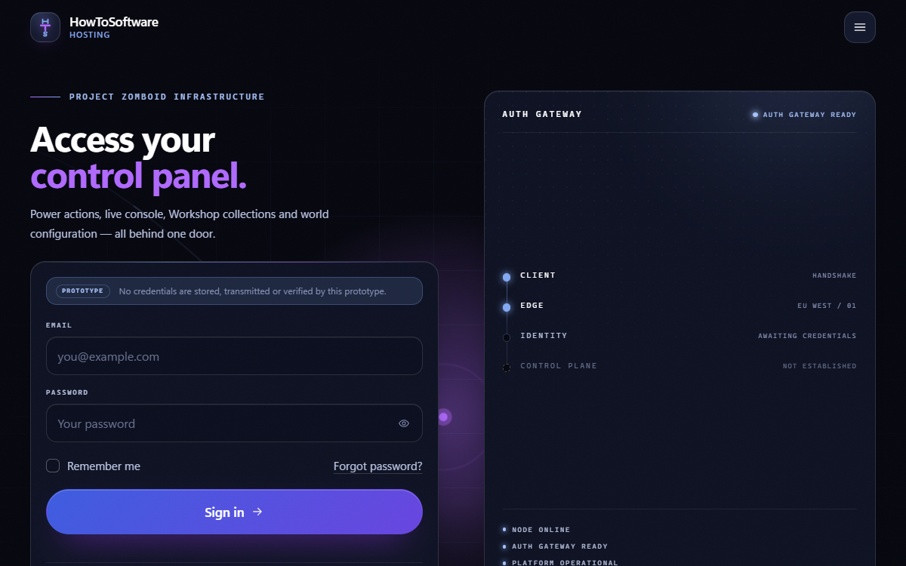
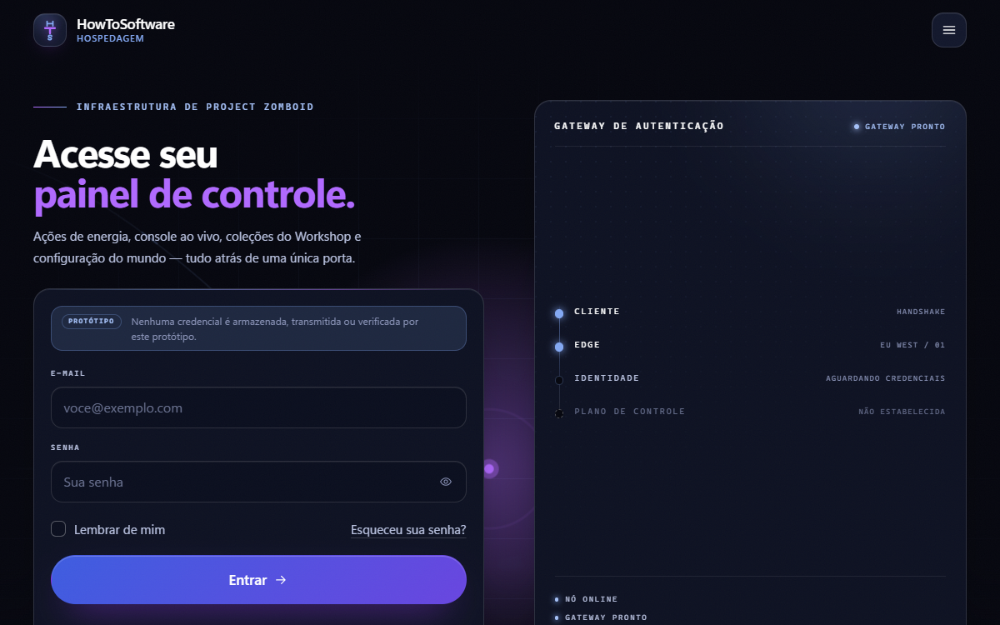
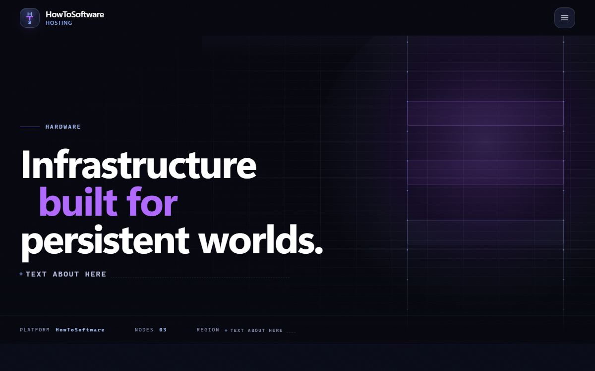
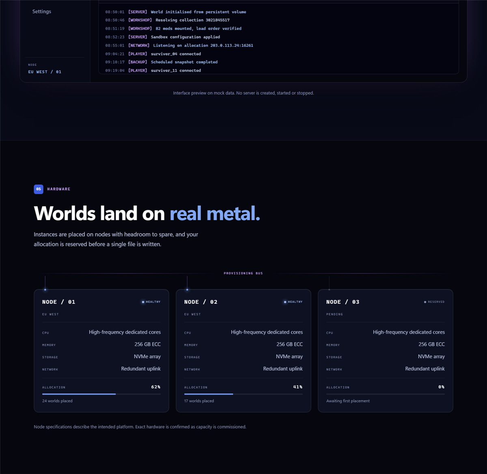
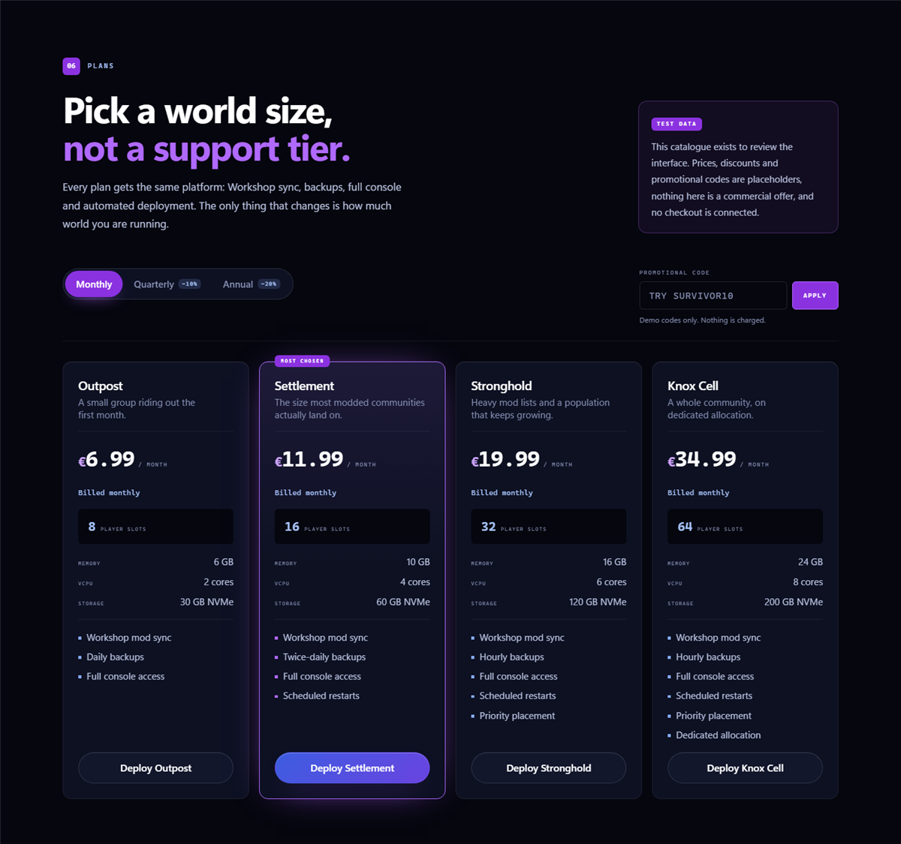

# HowToSoftware — Project Zomboid Hosting (Frontend Prototype)

A frontend prototype for the HowToSoftware **Project Zomboid server hosting** platform,
built with **C# / .NET 10 / Blazor**. Three pages, in **English and Brazilian Portuguese**.

> 🇧🇷 **A versão em português está mais abaixo** — veja [Português (BR)](#português-br).

---

> ### ⚠️ This is a prototype, not a product
>
> - **All pricing is placeholder test data.** The plans, prices, discounts and promotional
>   codes exist so the interface can be reviewed. **Nothing here is a commercial offer.**
> - **No checkout, no payments, no accounts, no database.** There is no billing provider
>   connected and nothing is charged.
> - **The control panel is a mock.** It looks and behaves like the real thing, but no server
>   is ever created, started or stopped.
> - **No game panel integration yet.** Pterodactyl is the intended target and the code is
>   structured for it, but it is not wired up.
> - **Sign-in authenticates nobody.** There is no identity provider, no user list, no demo
>   credential and no password storage. Every attempt reports that authentication is not
>   connected, and the screen says so before you type anything.
> - **The infrastructure page has no specifications in it.** CPU, memory, storage, network,
>   allocation and region are all still to be supplied, so the page shows a visible
>   `TEXT ABOUT HERE` placeholder wherever a figure or a sentence will go.

---

## Screenshots

### Dark theme (default)


### Light theme


### Sign in


### Sign in, in Brazilian Portuguese


### Infrastructure


### Control panel section


### Plan catalogue (test data)


---

## Quick start

**Requires the [.NET 10 SDK](https://dotnet.microsoft.com/download/dotnet/10.0).**
Check with `dotnet --list-sdks` — you need a `10.x` entry.

```bash
git clone https://github.com/gamerplay20p5-dotcom/howtoosoftware-hosting-prototype.git
cd howtoosoftware-hosting-prototype

dotnet run --project src/HowToSoftware.Hosting
```

Then open **http://localhost:5147**.

```bash
dotnet build          # build everything
dotnet test           # run the 153 unit tests
```

The site has three routes:

| Route | What it is |
|---|---|
| `/` | the marketing homepage |
| `/infrastructure` (also `/hardware`) | the hardware and infrastructure page |
| `/login` | the control-panel sign-in screen |

There is nothing else to install. No npm, no database, no configuration, no API keys.

---

## Language

The site ships in **English** and **Brazilian Portuguese**, and picks one for you on your
first visit from the browser's `Accept-Language` header. Anything Portuguese - `pt-BR`, `pt`,
even `pt-PT` - gets Brazilian Portuguese; anything the site does not speak falls back to
English.

The **EN / PT-BR** control in the header overrides that. It is two ordinary links pointing at
`/culture/select`, which writes the choice to a cookie and sends you back to the page you were
on, so the whole response comes back in the new language and stays there on your next visit.
No JavaScript is involved, and an explicit choice always beats the browser's preference.

Labels are language names, never flags - a language is not a country.

Everything is [.NET localisation](src/HowToSoftware.Hosting/Localization): `IStringLocalizer`
over four `.resx` resource sets, wired through `RequestLocalizationOptions` in
[`Program.cs`](src/HowToSoftware.Hosting/Program.cs). No translation widget, no runtime machine
translation, and no `if (language == "pt")` anywhere - components ask for a string and the
culture chosen for the request decides which resource answers.

| Resource set | Covers |
|---|---|
| `CommonText` | navigation, shared actions, footer, status labels, theme and language controls |
| `HomeText` | the homepage, plus the plan catalogue and marketing content behind the services |
| `LoginText` | the sign-in screen |
| `HardwareText` | the infrastructure page, including the `TEXT ABOUT HERE` placeholder |

---

## Switching between dark and light

The site ships **dark by default**. Use the **DARK / LIGHT toggle in the top-right of the
header** to switch. Your choice is remembered in `localStorage` and is applied before the
page paints, so there is no flash of the wrong theme on reload.

Both themes are driven from one file — [`wwwroot/css/theme.css`](src/HowToSoftware.Hosting/wwwroot/css/theme.css).
The light theme redefines design tokens only; no component CSS is duplicated.

Two deliberate decisions in the light theme:

1. **The brand ramp inverts its role.** On navy, the pale blues and purples carry text. On
   white those would be unreadable, so the same token names point at the deep steps instead.
   Components keep asking for "the blue that carries data" and get the right one per theme.
2. **The console stays dark in both themes.** A terminal is dark. Inverting it would read as
   a bug, not a theme.

Every visible text element was measured against its real rendered background in **both**
themes and passes **WCAG 2.1 AA** contrast.

---

## What is interactive vs. what is mock

Everything interactive is **Blazor / C# state** — there is no JavaScript framework here.

| Works for real (Blazor state) | Mock / placeholder data |
|---|---|
| Billing period switch (monthly / quarterly / annual) | The prices themselves |
| Promotional code field (try `SURVIVOR10`, `KNOX25`, `HTS2026`) | Discounts are display-only, nothing is charged |
| Control panel sidebar (Overview / Console / Mods) | Server metrics, console log, mod list |
| Start / Restart / Stop power buttons and their transitions | No real server is touched |
| Scroll-driven provisioning stages and the diagram that follows them | The deployment flow is illustrative |
| FAQ accordion, mobile navigation, theme toggle | — |
| Sign-in validation, password show/hide, remember me, busy state | No credentials are checked or stored |
| The auth gateway diagram, which follows the form's state | The hops it draws |
| Language switching and the culture cookie | — |

### About the JavaScript

There is exactly **one dependency-free JS file**
([`wwwroot/js/site.js`](src/HowToSoftware.Hosting/wwwroot/js/site.js)). It only reports browser
facts that neither C# nor CSS can observe: scroll position, element visibility, pointer
position, the saved theme, and when enhanced navigation has swapped the page.
**It holds no application state.**

The provisioning section is the clearest example of the split: JavaScript notices which
stage scrolled into the middle of the screen and calls a `[JSInvokable]` C# method. Blazor
then decides everything visible — which stage is active, which diagram nodes light up, the
step counter. **JavaScript observes; Blazor decides.**

The pointer spotlight on the panels is the same split again: JavaScript publishes where the
cursor is as two CSS custom properties, and the stylesheet decides what that looks like.

Without JavaScript the site still works: all content is visible, language switching still
works, and only the entrance animations are skipped. The site fully respects
`prefers-reduced-motion` - including the route entrance, which is switched off rather than
shortened.

---

## Project structure

```
src/HowToSoftware.Hosting/
├── Components/
│   ├── Layout/       SiteHeader, SiteFooter, MainLayout
│   ├── Shared/       BrandMark, CtaButton, Icon, ThemeToggle, LanguageSwitcher, CopySlot
│   ├── Home/         one component per homepage section (16 of them)
│   ├── Account/      the sign-in experience and its gateway instrument
│   ├── Hardware/     the infrastructure page's sections
│   └── Pages/        Home, Infrastructure, Login, Error, NotFound
├── Localization/     marker types + the .resx sets, and the culture policy
├── Models/           strongly-typed records (plans, telemetry, server state, …)
├── Services/         interfaces + the static/mock implementations behind them
└── wwwroot/
    ├── css/theme.css design tokens — the single source of truth for both themes
    ├── css/app.css    reset, typography, layout primitives, spotlight, route entrance
    └── js/site.js     the only JavaScript

tests/HowToSoftware.Hosting.Tests/   153 unit tests
```

Each component has its own scoped `.razor.css`, so styles cannot leak between sections.

### Page sections, in order

1. **Hero** — three layers: an animated infrastructure field, oversized type, and a cluster
   of connected UI fragments
2. **Telemetry strip** — live-looking platform readouts
3. **Persistent worlds** — editorial copy beside a Knox County coordinate grid
4. **Workshop** — a mod-synchronisation interface
5. **Provisioning** — sticky-scroll storytelling with a diagram that builds itself
6. **Control panel** — the product reveal, at near-full page width
7. **Nodes** — abstract hardware panels
8. **Capabilities** — numbered editorial blocks
9. **Plans** — the catalogue with billing switch and promo code
10. **FAQ** and **closing call to action**

### The infrastructure page

`/infrastructure` (and `/hardware`, which answers to the same component) explains the platform
the worlds run on. **Its copy has not been written yet**, so every descriptive slot renders
`TEXT ABOUT HERE` in a treatment that is unmistakably a placeholder — see
[`CopySlot.razor`](src/HowToSoftware.Hosting/Components/Shared/CopySlot.razor).

No two sections share a composition, and none of them states a specification:

1. **Hero** — a drawn rack elevation behind oversized type
2. **Physical infrastructure** — a specification ledger beside a twelve-unit rack drawing
3. **Node topology** — platform, provisioning bus, nodes and the servers they place worlds on,
   drawn as one continuous diagram that collapses to a single vertical run on a phone
4. **Compute** — a die plate with its active cores lit
5. **Memory** — three bands, distinguished by treatment rather than by width
6. **Storage** — a volume stack stepped in depth
7. **Network** — four hops on one rail, with a packet crossing it
8. **Server allocation** — a capacity schematic carved into instances
9. **Reliability and operations** — a ticked timeline of operational signals

Which composition each chapter gets is data, in
[`StaticInfrastructureContentService`](src/HowToSoftware.Hosting/Services/StaticInfrastructureContentService.cs),
and a test asserts no two consecutive chapters repeat one.

### The sign-in page

`/login` is a complete sign-in screen with nothing behind it. The form is a Blazor island: the
validation, the password reveal, the busy state and every notice are C# state, and the gateway
instrument beside it draws where the current attempt actually got to — client, edge, then a
stop at identity, because there is nothing there to answer.

`IAuthenticationGateway` is the seam a real provider plugs into. The prototype implementation
behind it reads nothing, compares nothing and stores nothing; see
[`PrototypeAuthenticationGateway`](src/HowToSoftware.Hosting/Services/PrototypeAuthenticationGateway.cs)
for why that is the only honest stand-in.

---

## Ready for the real backend

The mock data sits behind interfaces, so replacing it does not touch a single component:

| Interface | Prototype implementation | Future implementation |
|---|---|---|
| `IServerPreviewService` | `MockServerPreviewService` | Pterodactyl API client |
| `IPlanCatalogService` | `StaticPlanCatalogService` | Real pricing + billing provider |
| `IMarketingContentService` | `StaticMarketingContentService` | CMS or database |
| `IInfrastructureContentService` | `StaticInfrastructureContentService` | Real node specifications and status |
| `IAuthenticationGateway` | `PrototypeAuthenticationGateway` | ASP.NET Core Identity, or an OIDC provider |

Swap the registration in [`Program.cs`](src/HowToSoftware.Hosting/Program.cs) and the UI
keeps working. `IServerPreviewService` is already **async and command-based**, matching how
a real game-panel API behaves: a power action returns immediately with a transitional state,
and the caller polls until the instance settles.

---

## Brand and design system

Palette: **Light Blue + Purple + White**, on a deep navy foundation.

Colours were sampled from the HTS logo itself:

| Role | Colour |
|---|---|
| Logo purple — brand accent, CTAs, active states | `#B069FF` |
| Logo light blue — technical data, metrics, status | `#83A8F3` |
| White — typography and hierarchy | `#FFFFFF` |
| Deep navy — background foundation only | `#05060E` |

Status indicators deliberately use **blue and purple instead of the usual green and amber**,
so nothing on the page falls outside the brand.

---

## Not implemented yet

- Payments, checkout and real pricing
- Customer accounts and authentication (the sign-in screen exists; nothing is behind it)
- Account creation and password recovery
- The infrastructure page's copy and specifications
- Pterodactyl / game panel integration
- Database and server provisioning
- Legal pages (Terms, Privacy, Acceptable Use) — shown as "Soon" placeholders
- A real contact address (currently a placeholder in `appsettings.json`)

---

## Licence

See [LICENSE](LICENSE). This is **proprietary software** —
© 2026 Henry Lawrence Cahill. All rights reserved.

---
---

# Português (BR)

Protótipo de frontend para a plataforma de **hospedagem de servidores de Project Zomboid**
da HowToSoftware, feito em **C# / .NET 10 / Blazor**. Três páginas, em **inglês e português
do Brasil**.

---

> ### ⚠️ Isto é um protótipo, não um produto
>
> - **Todos os preços são dados de teste.** Os planos, preços, descontos e cupons existem
>   apenas para avaliar a interface. **Nada aqui é uma oferta comercial.**
> - **Sem checkout, sem pagamentos, sem contas, sem banco de dados.** Não há nenhum gateway
>   conectado e nada é cobrado.
> - **O painel de controle é simulado.** Ele se parece e se comporta como o real, mas nenhum
>   servidor é criado, iniciado ou parado.
> - **Ainda não há integração com painel de jogo.** O Pterodactyl é o alvo pretendido e o
>   código está estruturado para isso, mas não está conectado.
> - **O login não autentica ninguém.** Não existe provedor de identidade, lista de usuários,
>   credencial de demonstração nem armazenamento de senha. Toda tentativa informa que a
>   autenticação não está conectada, e a tela avisa isso antes de você digitar qualquer coisa.
> - **A página de infraestrutura não tem nenhuma especificação.** CPU, memória, armazenamento,
>   rede, alocação e região ainda serão fornecidos, então a página mostra o marcador visível
>   `TEXTO SOBRE AQUI` onde entrarão os números e os textos.

---

## Como rodar

**Requer o [SDK do .NET 10](https://dotnet.microsoft.com/download/dotnet/10.0).**
Confira com `dotnet --list-sdks` — precisa aparecer uma versão `10.x`.

```bash
git clone https://github.com/gamerplay20p5-dotcom/howtoosoftware-hosting-prototype.git
cd howtoosoftware-hosting-prototype

dotnet run --project src/HowToSoftware.Hosting
```

Depois abra **http://localhost:5147**.

```bash
dotnet build          # compila tudo
dotnet test           # roda os 153 testes unitários
```

O site tem três rotas:

| Rota | O que é |
|---|---|
| `/` | a página inicial |
| `/infrastructure` (e também `/hardware`) | a página de hardware e infraestrutura |
| `/login` | a tela de acesso ao painel de controle |

Não precisa instalar mais nada. Sem npm, sem banco de dados, sem configuração, sem chaves.

---

## Idioma

O site vem em **inglês** e **português do Brasil**, e escolhe um para você na primeira visita
a partir do cabeçalho `Accept-Language` do navegador. Qualquer variante de português -
`pt-BR`, `pt` e até `pt-PT` - recebe português do Brasil; qualquer idioma que o site não fale
cai para o inglês.

O controle **EN / PT-BR** no cabeçalho passa por cima disso. São dois links comuns apontando
para `/culture/select`, que grava a escolha em um cookie e devolve você para a página em que
estava, então a resposta inteira volta no novo idioma e continua assim na próxima visita. Não
tem JavaScript envolvido, e a escolha explícita sempre vence a preferência do navegador.

Os rótulos são nomes de idioma, nunca bandeiras - idioma não é país.

Tudo é [localização do .NET](src/HowToSoftware.Hosting/Localization): `IStringLocalizer` sobre
quatro conjuntos `.resx`, ligados por `RequestLocalizationOptions` no
[`Program.cs`](src/HowToSoftware.Hosting/Program.cs). Sem widget de tradução, sem tradução
automática em tempo de execução e sem nenhum `if (language == "pt")` espalhado - os componentes
pedem uma string e a cultura escolhida para a requisição decide qual recurso responde.

| Conjunto de recursos | Cobre |
|---|---|
| `CommonText` | navegação, ações compartilhadas, rodapé, rótulos de status, tema e idioma |
| `HomeText` | a página inicial, mais o catálogo de planos e o conteúdo por trás dos serviços |
| `LoginText` | a tela de acesso |
| `HardwareText` | a página de infraestrutura, incluindo o marcador `TEXTO SOBRE AQUI` |

---

## Alternando entre tema escuro e claro

O site vem **escuro por padrão**. Use o **botão DARK / LIGHT no canto superior direito do
cabeçalho** para trocar. A escolha fica salva no `localStorage` e é aplicada antes da página
renderizar, então não existe aquele "flash" de tema errado ao recarregar.

Os dois temas saem de um único arquivo:
[`wwwroot/css/theme.css`](src/HowToSoftware.Hosting/wwwroot/css/theme.css). O tema claro
apenas redefine os tokens de design; nenhum CSS de componente é duplicado.

Duas decisões propositais no tema claro:

1. **A escala da marca inverte de papel.** No fundo escuro, os tons claros de azul e roxo
   carregam o texto. No branco eles seriam ilegíveis, então os mesmos nomes de token apontam
   para os tons profundos. Os componentes continuam pedindo "o azul que carrega dado" e
   recebem o certo em cada tema.
2. **O console continua escuro nos dois temas.** Terminal é escuro. Inverter isso pareceria
   um bug, não um tema.

Todo texto visível foi medido contra o fundo real renderizado nos **dois** temas e passa no
contraste **WCAG 2.1 AA**.

---

## O que é interativo de verdade vs. o que é simulado

Tudo que é interativo é **estado Blazor / C#** — não existe framework JavaScript aqui.

| Funciona de verdade (estado Blazor) | Dados simulados |
|---|---|
| Troca de período (mensal / trimestral / anual) | Os preços em si |
| Campo de cupom (teste `SURVIVOR10`, `KNOX25`, `HTS2026`) | Descontos são só visuais, nada é cobrado |
| Menu lateral do painel (Overview / Console / Mods) | Métricas, log do console, lista de mods |
| Botões Start / Restart / Stop e suas transições | Nenhum servidor real é tocado |
| Estágios de provisionamento guiados por scroll e o diagrama que os acompanha | O fluxo é ilustrativo |
| Acordeão do FAQ, menu mobile, troca de tema | — |
| Validação do login, mostrar/ocultar senha, lembrar de mim, estado de carregamento | Nenhuma credencial é verificada ou guardada |
| O diagrama do gateway de autenticação, que segue o estado do formulário | Os saltos que ele desenha |
| Troca de idioma e o cookie de cultura | — |

### Sobre o JavaScript

Existe exatamente **um arquivo JS sem dependências**
([`wwwroot/js/site.js`](src/HowToSoftware.Hosting/wwwroot/js/site.js)). Ele só reporta fatos do
navegador que nem o C# nem o CSS conseguem observar: posição de scroll, visibilidade de
elementos, posição do ponteiro, o tema salvo e quando a navegação aprimorada trocou a página.
**Ele não guarda nenhum estado da aplicação.**

A seção de provisionamento é o exemplo mais claro dessa divisão: o JavaScript percebe qual
estágio entrou no meio da tela e chama um método C# marcado com `[JSInvokable]`. O Blazor
então decide tudo que aparece — qual estágio está ativo, quais nós do diagrama acendem, o
contador de etapa. **O JavaScript observa; o Blazor decide.**

O spotlight do cursor nos painéis é a mesma divisão de novo: o JavaScript publica onde o
cursor está como duas custom properties de CSS, e a folha de estilo decide como isso aparece.

Sem JavaScript o site continua funcionando: todo o conteúdo aparece, a troca de idioma continua
funcionando e só as animações de entrada são puladas. O site respeita `prefers-reduced-motion`
por completo - inclusive a entrada de rota, que é desligada em vez de encurtada.

---

## Estrutura do projeto

```
src/HowToSoftware.Hosting/
├── Components/
│   ├── Layout/       SiteHeader, SiteFooter, MainLayout
│   ├── Shared/       BrandMark, CtaButton, Icon, ThemeToggle, LanguageSwitcher, CopySlot
│   ├── Home/         um componente por seção da página inicial (16 no total)
│   ├── Account/      a tela de acesso e seu instrumento de gateway
│   ├── Hardware/     as seções da página de infraestrutura
│   └── Pages/        Home, Infrastructure, Login, Error, NotFound
├── Localization/     tipos marcadores + os conjuntos .resx, e a política de cultura
├── Models/           records fortemente tipados (planos, telemetria, estado do servidor…)
├── Services/         interfaces + as implementações estáticas/simuladas
└── wwwroot/
    ├── css/theme.css tokens de design — fonte única de verdade dos dois temas
    ├── css/app.css    reset, tipografia, primitivos, spotlight, entrada de rota
    └── js/site.js     o único JavaScript

tests/HowToSoftware.Hosting.Tests/   153 testes unitários
```

Cada componente tem seu próprio `.razor.css` isolado, então estilo não vaza entre seções.

### Seções da página, em ordem

1. **Hero** — três camadas: campo de infraestrutura animado, tipografia grande e um conjunto
   de fragmentos de UI conectados
2. **Faixa de telemetria** — leituras da plataforma
3. **Mundos persistentes** — texto editorial ao lado de uma grade de coordenadas de Knox County
4. **Workshop** — uma interface de sincronização de mods
5. **Provisionamento** — narrativa com scroll fixo e um diagrama que se constrói sozinho
6. **Painel de controle** — a revelação do produto, quase na largura toda da página
7. **Nós** — painéis abstratos de hardware
8. **Capacidades** — blocos editoriais numerados
9. **Planos** — o catálogo com troca de período e cupom
10. **FAQ** e **chamada final**

### A página de infraestrutura

`/infrastructure` (e `/hardware`, que responde pelo mesmo componente) explica a plataforma em
que os mundos rodam. **O texto dela ainda não foi escrito**, então todo espaço descritivo
mostra `TEXTO SOBRE AQUI` num tratamento que é inconfundivelmente um marcador — veja
[`CopySlot.razor`](src/HowToSoftware.Hosting/Components/Shared/CopySlot.razor).

Nenhuma seção repete a composição de outra, e nenhuma afirma uma especificação:

1. **Hero** — uma elevação de rack desenhada atrás de tipografia grande
2. **Infraestrutura física** — uma ficha técnica ao lado de um rack de doze unidades
3. **Topologia de nós** — plataforma, barramento de provisionamento, nós e os servidores em que
   os mundos são colocados, desenhados como um diagrama contínuo que vira uma coluna vertical
   no celular
4. **Computação** — uma pastilha com os núcleos ativos acesos
5. **Memória** — três faixas, diferenciadas pelo tratamento e não pela largura
6. **Armazenamento** — uma pilha de volumes escalonada em profundidade
7. **Rede** — quatro saltos em um trilho, com um pacote atravessando
8. **Alocação de servidor** — um esquema de capacidade dividido em instâncias
9. **Confiabilidade e operações** — uma linha do tempo marcada com os sinais operacionais

Qual composição cada capítulo recebe é dado, no
[`StaticInfrastructureContentService`](src/HowToSoftware.Hosting/Services/StaticInfrastructureContentService.cs),
e um teste garante que dois capítulos seguidos nunca repitam a mesma.

### A página de login

`/login` é uma tela de acesso completa sem nada por trás. O formulário é uma ilha Blazor: a
validação, o botão de mostrar a senha, o estado de carregamento e todos os avisos são estado em
C#, e o instrumento de gateway ao lado desenha até onde a tentativa atual realmente chegou —
cliente, edge e então uma parada na identidade, porque não há nada ali para responder.

O `IAuthenticationGateway` é a costura em que um provedor real vai se encaixar. A implementação
de protótipo por trás dele não lê nada, não compara nada e não guarda nada; veja o
[`PrototypeAuthenticationGateway`](src/HowToSoftware.Hosting/Services/PrototypeAuthenticationGateway.cs)
para o porquê de esse ser o único comportamento honesto.

---

## Pronto para o backend real

Os dados simulados ficam atrás de interfaces, então trocá-los não mexe em nenhum componente:

| Interface | Implementação do protótipo | Implementação futura |
|---|---|---|
| `IServerPreviewService` | `MockServerPreviewService` | Cliente da API do Pterodactyl |
| `IPlanCatalogService` | `StaticPlanCatalogService` | Preços reais + gateway de pagamento |
| `IMarketingContentService` | `StaticMarketingContentService` | CMS ou banco de dados |
| `IInfrastructureContentService` | `StaticInfrastructureContentService` | Especificações e status reais dos nós |
| `IAuthenticationGateway` | `PrototypeAuthenticationGateway` | ASP.NET Core Identity, ou um provedor OIDC |

Basta trocar o registro no [`Program.cs`](src/HowToSoftware.Hosting/Program.cs) que a UI
continua funcionando. O `IServerPreviewService` já é **assíncrono e baseado em comandos**,
igual ao comportamento de uma API de painel real: a ação de energia retorna na hora com um
estado transitório e quem chamou fica consultando até a instância estabilizar.

---

## Marca e design system

Paleta: **Azul Claro + Roxo + Branco**, sobre uma base azul-marinho profunda.

As cores foram extraídas do próprio logo da HTS:

| Papel | Cor |
|---|---|
| Roxo do logo — destaque da marca, CTAs, estados ativos | `#B069FF` |
| Azul claro do logo — dados técnicos, métricas, status | `#83A8F3` |
| Branco — tipografia e hierarquia | `#FFFFFF` |
| Azul-marinho profundo — apenas o fundo | `#05060E` |

Os indicadores de status usam propositalmente **azul e roxo no lugar do verde e âmbar
habituais**, para que nada na página saia da identidade da marca.

---

## Ainda não implementado

- Pagamentos, checkout e preços reais
- Contas de cliente e autenticação (a tela de acesso existe; não há nada por trás dela)
- Criação de conta e recuperação de senha
- O texto e as especificações da página de infraestrutura
- Integração com Pterodactyl / painel de jogo
- Banco de dados e provisionamento de servidores
- Páginas legais (Termos, Privacidade, Uso Aceitável) — aparecem como "Soon"
- Um endereço de contato real (hoje é um placeholder no `appsettings.json`)

---

## Licença

Veja [LICENSE](LICENSE). Este é um **software proprietário** —
© 2026 Henry Lawrence Cahill. Todos os direitos reservados.
