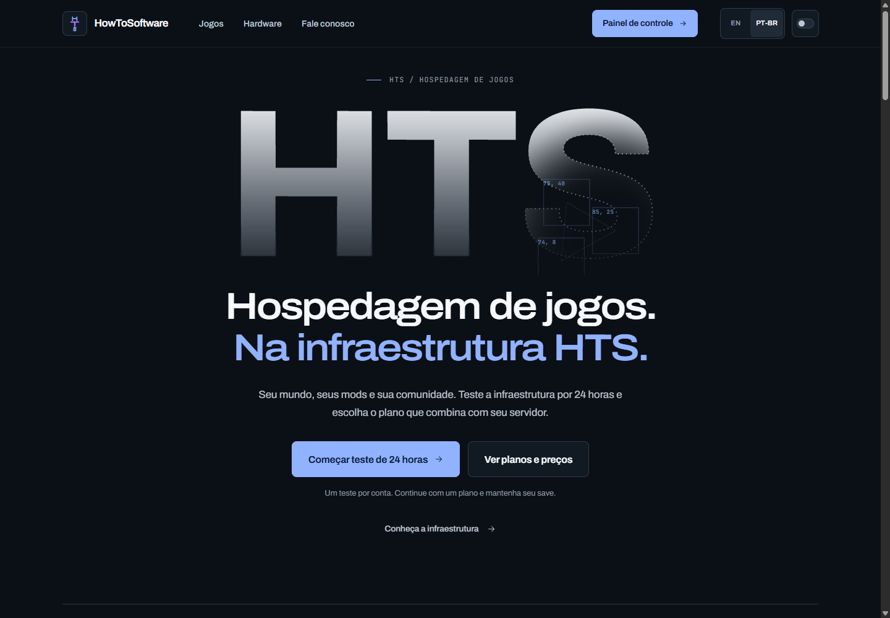

# HTS Hosting

> **Status:** Checked against the local code; team review pending
>
> **Owner:** HTS / HowToSoftware maintainers
>
> **Last updated:** 2026-10-05

Game server hosting storefront for **HTS / HowToSoftware**, built with ASP.NET Core and Blazor on .NET 10. Visitors explore the infrastructure, start an email-verified 24-hour trial of Project Zomboid or Minecraft, compare plans and proceed to Stripe. When configured, the backend provisions servers through Pterodactyl and converts paid trials on the same server, preserving the customer's world.

The repository retains “prototype” in its name, but the commerce and provisioning foundation is implemented. The site also serves public pages without integration credentials. Production machine configuration is external to this checkout; this documentation describes the code available locally.

[**Start with the documentation index**](docs/README.md) · [Run locally](docs/phase-3-development/onboarding.md) · [Architecture](docs/phase-2-design/architecture.md) · [Deployment](docs/DEPLOYMENT.md)



## Implemented capabilities

| Area | Current behavior | Limitation or dependency |
| --- | --- | --- |
| Catalog | Project Zomboid plans; Minecraft trials and configured upgrade tiers | Minecraft paid tiers require agreed pricing and matching commerce rows |
| Plans | Eight configurations, from 4 to 16 GiB; monthly, quarterly, and annual billing | Prices depend on configured rates or overrides |
| Checkout | SSR review, server-validated promotion code, and subscription Checkout through Stripe | Requires configured Stripe and order persistence |
| Payment | Webhook signature, amount/currency verification, and idempotent processing | The success page does not confirm payment on its own |
| Provisioning | Worker, order recovery, and idempotent Pterodactyl creation | Requires panel, egg, location, and available resources |
| Persistence | SQL Server for commerce; an alternative orders context | Migrations are explicit and do not run when the site starts |
| Frontend | Light/dark themes, EN and PT-BR, responsive navigation, and animations with fallbacks | Spanish is not implemented in this repository yet |
| HTS wordmark | Large animated HTS mark centered above the opening heading; bounded WebGL and static fallback | Pauses offscreen; reduced motion supported |
| Custom configuration | Resource estimate and email draft | Does not automatically create a purchase or server |
| Infrastructure | Real photography, one specification sheet and native disclosures | Editorial facts; no invented live telemetry |
| Local login and registration | Demonstration interfaces that do not authenticate or create accounts | The external panel is a separate application |
| Automatic trials | Verified email → account/server → 24 hours → suspension → 72-hour save retention; one per account across PZ/Minecraft | Requires commerce migration, HTS/panel SMTP and Pterodactyl; new requests disabled by default |

An authenticated billing portal, invoice downloads, administrative controls, and automatic subscription-driven suspension remain outside the public interface. See [scope and outstanding work](docs/phase-1-inception/vision-and-scope.md).

Configure trials with [TRIAL-SERVERS.md](docs/TRIAL-SERVERS.md). Defaults for both games are 6 GiB RAM, 25 GiB disk and CPU 0 (unlimited shared CPU). Minecraft selection is limited to operator-approved Java/Bedrock profiles, variants and versions. Payment upgrades the existing server without reinstalling its world. Public promotions advertise only explicitly selected, currently valid database coupons.

## Run a local preview

Requirements: **.NET 10** SDK and Git. There is no required npm, React, or Tailwind step.

```powershell
dotnet restore HowToSoftware.Hosting.slnx
dotnet build HowToSoftware.Hosting.slnx -c Release --no-restore
dotnet test HowToSoftware.Hosting.slnx -c Release --no-build
```

To start at `http://localhost:5147`, follow the [onboarding guide](docs/phase-3-development/onboarding.md). It includes an isolated preview that avoids loading an existing `.env` or accessing real integrations. To configure commerce, follow the [configuration map](docs/phase-3-development/configuration.md), [SQL Server](docs/SQLSERVER-SETUP.md), [Stripe](docs/stripe-testing.md), and [Pterodactyl](docs/PTERODACTYL-SETUP.md) guides.

The local `.env` belongs at the repository root, next to this README. It is intentionally excluded from Git and the Docker build context; only [.env.example](.env.example) is published. Create it from the example only when no local file exists, then configure the required services privately. An unconfigured preview should leave integration credentials and connection strings empty. Production uses the host's existing private `server.env` and `migrate.env`, described in [DEPLOYMENT.md](docs/DEPLOYMENT.md); a Git push does not replace those files.

## Pages and access

| Path | Purpose |
| --- | --- |
| `/` | Introduction, plan selection, benefits, infrastructure, and contact |
| `/game-hosting` | Game catalog and availability |
| `/game-hosting/project-zomboid` | Product, plan comparison, and billing periods |
| `/game-hosting/minecraft` | Edition/version trial entry and configured paid upgrade plans |
| `/trial` | Trial selection, email confirmation, owner recovery and status |
| `/game-hosting/project-zomboid/review?plan=zomboid-4gb&period=monthly` | Review before payment |
| `/infrastructure` | Hardware, photographs, and infrastructure information |
| `/payment/success`, `/payment/cancel` | Checkout return |
| `/login`, `/register` | Local demonstration interfaces |
| `/health` | Application health and commerce SQL Server connectivity, when configured |

`/hardware` is an infrastructure alias; `/project-zomboid` permanently redirects to the product. The `/dev/provisioning` lab requires Development and explicit enablement. Panel links point to `https://panel.howto.software/auth/login`. Full contracts: [routes and endpoints](docs/phase-2-design/api-specification.md).

## Code organization

- [src/HowToSoftware.Hosting](src/HowToSoftware.Hosting): Razor components, services, domain, integrations, and assets.
- [tests/HowToSoftware.Hosting.Tests](tests/HowToSoftware.Hosting.Tests): catalog, pricing, purchase, security, persistence, and provisioning tests.
- [deploy](deploy): bootstrap, production composition, and deployment.
- [.github/workflows/ci-cd.yml](.github/workflows/ci-cd.yml): build, tests, GHCR image, and deployment.
- [docs](docs/README.md): documentation by phase, technical guides, and visual evidence.

Use the [project map](docs/PROJECT-MAP.md) to locate each responsibility.

## Visual redesign and recorded validation

The third iteration keeps graphite, neutral paper and cobalt, with a large centered HTS wordmark, a simpler opening, compact infrastructure and a direct 24-hour trial entry. Motion supports navigation, focus and content reveals. The [frontend guide](docs/FRONTEND-REDESIGN.md) explains OriginKit and Skiper UI adaptations, WebGL lifecycle, accessibility, licensing and Blazor integration decisions.

The verification recorded on 2026-10-05 reported **627 passing tests**, Release compilation without warnings or errors, and **77 Chromium checks**. These are isolated local results; production SQL, mail delivery, payment and panel operations were not exercised. See the [test plan](docs/phase-4-testing/test-plan.md), [main browser report](docs/frontend/qa-v3.json) and [trial browser report](docs/frontend/qa-v3-trial.json).

## Contribution and license

Read [CONTRIBUTING.md](CONTRIBUTING.md), the [changelog](CHANGELOG.md), and [SECURITY.md](SECURITY.md). The project retains its [existing proprietary license](LICENSE); adopting the `best-document` structure does not change project or third-party component rights.
