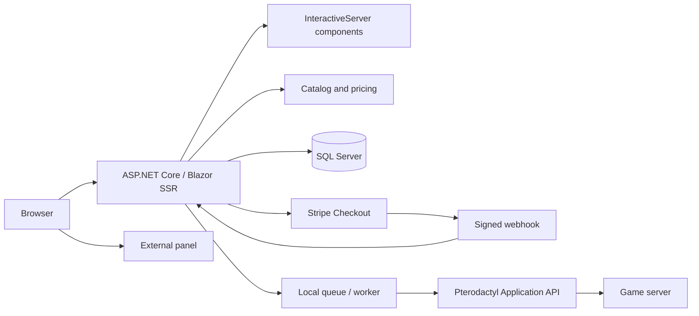

# Application architecture

> **Status:** Checked against the local code; team review pending
>
> **Owner:** HTS / HowToSoftware maintainers
>
> **Last updated:** 2026-10-05

HTS Hosting is a single ASP.NET Core application with Blazor pages, HTTP endpoints, and a hosted worker in the same process. Stripe, SQL Server, and Pterodactyl are external dependencies; the site container does not host the panel or game servers.

## Layers and responsibilities

| Layer | Responsibility | Directory |
| --- | --- | --- |
| Presentation | Pages, composition, copy, and accessible controls | `Components`, `Localization`, `wwwroot` |
| Domain | Plans, quotes, states, and order rules | `Models` |
| Application | Pricing, checkout, webhooks, fulfillment, content, and estimates | `Services` |
| Integrations | Stripe/Pterodactyl clients, options, configuration, and HTTP security | `Infrastructure` |
| Persistence | EF Core, mappings, migrations, and development seed | `Data` |
| HTTP contracts | Webhook and public status reads | `Endpoints` |
| Composition | Dependency registration and pipeline | `Program.cs` |

## Rendering and frontend

Public pages deliver content through SSR. Components needing continuous state use InteractiveServer, requiring a circuit connection and WebSocket support in the proxy. The hero is static SSR above a bounded decorative WebGL background; the product picker uses native radio controls. Custom configuration retains server interactivity.

Isolated CSS belongs to its component; tokens live in `theme.css`, and shared styles in `app.css`/`storefront.css`. JavaScript handles effects and navigation while preserving Blazor-rendered nodes. WebGL is decorative and has a fallback. See [frontend details](../FRONTEND-REDESIGN.md).

## Persistence modes

1. Valid commerce SQL Server configuration: `CommerceDbContext`, commerce stores, billing, promotions, and provisioning state.
2. Without commerce, but with `ConnectionStrings:Hosting`: `HostingDbContext` and an orders store; supplementary commerce services use null implementations.
3. Without either: public pages work, but orders have no usable persistence. The worker still queries the alternative context and logs a configuration failure; pages remain available.

The mode is selected during composition without querying the database during registration. A populated but invalid commerce connection string prevents startup. `/health` checks the configured commerce database connection, not every integration.

## Boundaries and recovery

The queue channel is process-local. The store persists orders, and the worker queries orders awaiting fulfillment at startup. Pterodactyl creation uses an external ID derived from the order to avoid duplicate servers on retry. This combination is not a distributed broker or a guarantee of exclusive execution across multiple replicas.

Before scaling horizontally, evaluate worker concurrency, locks/leases, shared Data Protection keys, and a circuit backplane. The repository does not document a complete multiple-replica configuration.

Sources: [Program.cs](../../src/HowToSoftware.Hosting/Program.cs), [commerce](../COMMERCE-ARCHITECTURE.md), [data](data-model.md), [ADRs](adr/README.md).

## Trial lifecycle

Native request/confirmation forms verify email possession before provisioning. SQL Server persists one trial per normalized email and panel account, verification/access token hashes, clocks, leases and permanent upgrade-order links. A scoped worker resumes installation, suspends at 24 hours and removes an unconverted server after 72 additional hours. Checkout reserves verified ownership; paid fulfillment updates the existing server's limits and resumes it, with no reinstall or new-server fallback. See [trial contracts and configuration](../TRIAL-SERVERS.md).
