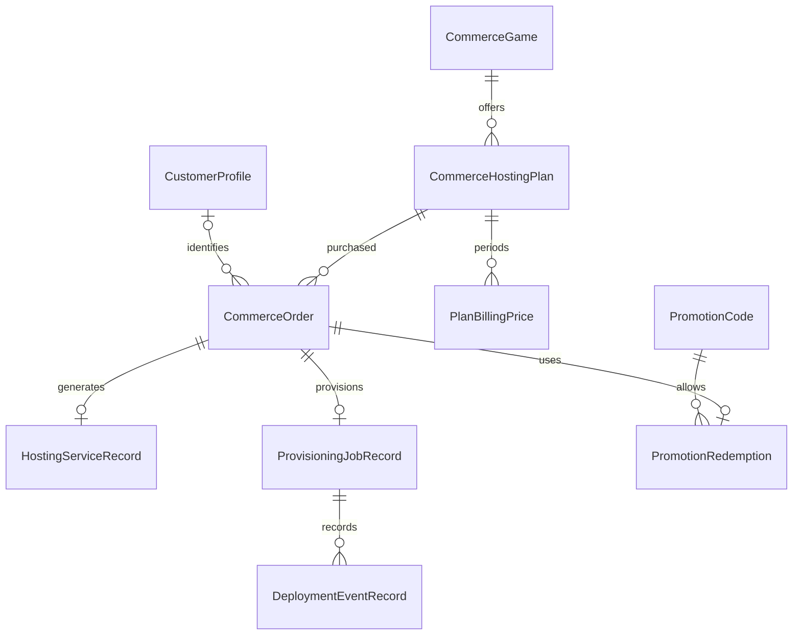

# Data model and states

> **Status:** Checked against the local code; team review pending
>
> **Owner:** HTS / HowToSoftware maintainers
>
> **Last updated:** 2026-10-05

The order domain uses `Models/Orders/Order.cs`. Commerce persistence uses `Models/Commerce/CommerceEntities.cs`, `Models/Commerce/PromotionModels.cs`, and `Data/CommerceDbContext.cs`. Domain objects and EF entities are distinct; stores translate between them.

## Commerce entities

| Entity / DbSet | Main information |
| --- | --- |
| CustomerProfile / CustomerProfiles | Stable HTS identity, email, and Stripe customer reference |
| CommerceGame / Games | Game slug, availability, and presentation |
| CommerceHostingPlan / HostingPlans | Resources, price in cents, currency, and ordering |
| PlanBillingPrice / PlanBillingPrices | Plan/period, discount, and Stripe references |
| CommerceOrder / Orders | Purchase snapshot, status, and integration references |
| HostingServiceRecord / HostingServices | Service linked to the order, subscription, and server |
| StripeEventRecord / StripeEvents | Received event and idempotent processing |
| ProvisioningJobRecord / ProvisioningJobs | State, attempts, and fulfillment tracking |
| HostingNodeRecord / HostingNodes | Node configuration, maintenance, and priority |
| GameDeploymentProfileRecord / GameDeploymentProfiles | Per-game template/deployment profile |
| DeploymentEventRecord / DeploymentEvents | Job tracking events |
| BillingInvoiceReference / BillingInvoiceRefs | Stripe invoice references, without full card data |
| PromotionCode / PromotionCodes | Promotion conditions and limits |
| PromotionRedemption / PromotionRedemptions | Redemption linked to promotion and order |

The relationships below summarize the domain; exact nullability, filters, and delete rules are in the EF mapping.

## Integrity and values

IDs are internal GUIDs; slugs publicly identify products. Persisted commerce amounts use cents; quote calculations use decimal and explicit rounding.

Unique indexes protect Stripe event IDs, checkout sessions, job/service relationships, and redemptions. Optional indexes use `IS NOT NULL` filters as required by SQL Server. Do not remove uniqueness to work around duplicate webhooks.

The public catalog still comes from static services/configuration. Catalog tables and seed data do not mean that every SQL change automatically appears in cards. Seed execution is explicit, idempotent, and restricted to Development.

## Order state

| Status | Meaning |
| --- | --- |
| Pending | Order created; payment not yet confirmed |
| Paid | Financial confirmation accepted |
| Provisioning | Fulfillment in progress |
| Active | Installation considered ready based on the panel response |
| Failed | Payment, verification, or provisioning failure |
| Cancelled | Expired session/cancellation as handled by the flow |

`Order` protects transitions; do not change the numeric ordering of persisted enums. Fulfillment stages are NotStarted, Preparing, NodeSelected, ResourcesAllocated, Installing, Online, and Failed. “Online” derives from installation state reported by the panel, not an external test of connected players.

## Contexts and migrations

- `CommerceDbContext`: full commerce foundation; history table `__EFMigrationsHistory_Commerce`.
- `HostingDbContext`: smaller orders alternative; history table `__EFMigrationsHistory_Hosting`.
- SQLite is used in tests, not as the application's production database.
- Commands: `--migrate-commerce`, `--migrate-hosting`; optional `--seed-commerce` is Development-only.

Do not apply both indiscriminately: choose the context for the target configuration. The [SQL Server guide](../SQLSERVER-SETUP.md) covers identities, permissions, and procedures. Schema changes must remain compatible with the previous image and update persistence tests.

Sources: [CommerceDbContext](../../src/HowToSoftware.Hosting/Data/CommerceDbContext.cs), [entities](../../src/HowToSoftware.Hosting/Models/Commerce/CommerceEntities.cs), [Order](../../src/HowToSoftware.Hosting/Models/Orders/Order.cs).

## Automatic trials

The unapplied `AddServerTrials` commerce migration adds `server_trials` and `trial_upgrade_orders`. Unique normalized-email and filtered panel-user indexes enforce a global single trial across games. Token hashes establish email-verified access; lease fields serialize lifecycle work across replicas. Permanent order links distinguish a paid conversion from fresh provisioning even after an unpaid reservation expires. Trial records remain after server deletion to preserve the one-use claim. See [trial lifecycle](../TRIAL-SERVERS.md).
