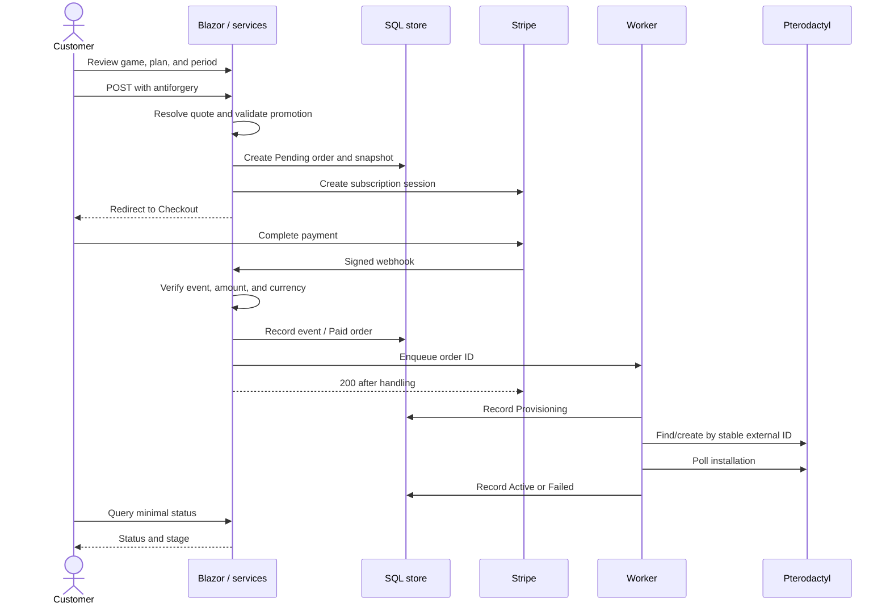
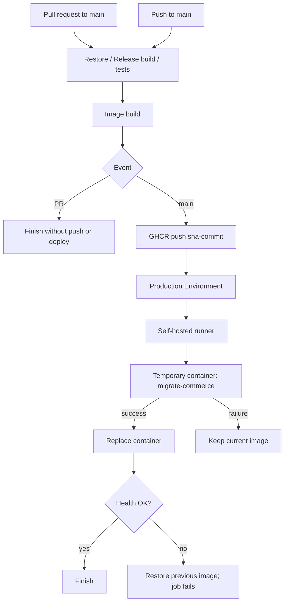
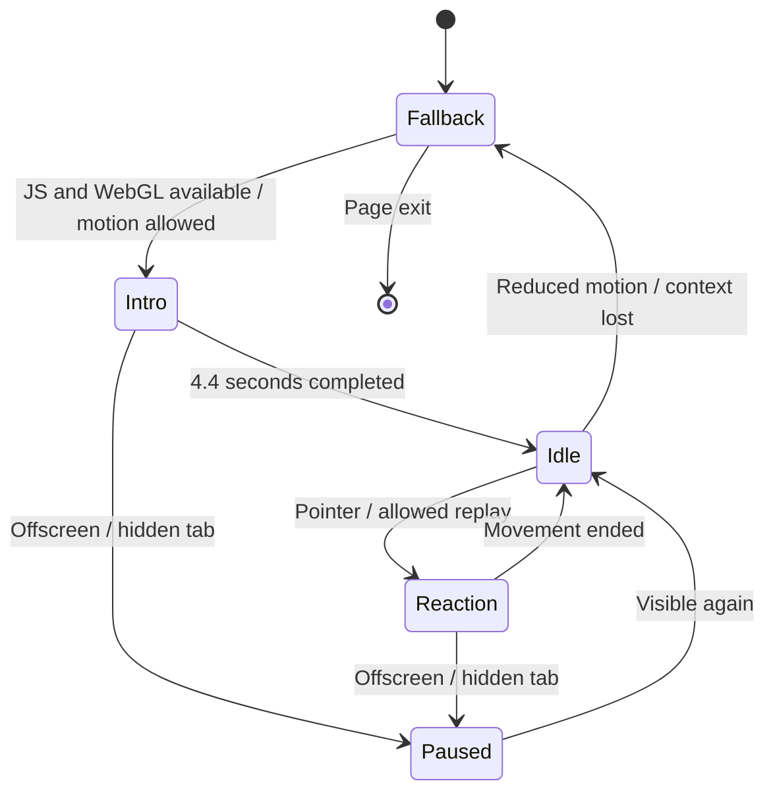

# Main flow diagrams

> **Status:** Checked against the local code; team review pending
>
> **Owner:** HTS / HowToSoftware maintainers
>
> **Last updated:** 2026-10-05

These diagrams describe the current code and are versioned as text. The [component architecture](architecture.md) and [data relationships](data-model.md) complement the flows below.

## Purchase and fulfillment

Write ordering and idempotency are implemented in stores and services, without a distributed transaction with Stripe/Pterodactyl. Browser return and webhook may arrive in different orders.

## Deployment

Environment reviewers and restrictions must be verified in GitHub. Image rollback does not reverse migrations.

## Animation lifecycle

This diagram summarizes the visual lifecycle; context recovery and teardown are implemented in `vector-wordmark.js`. See details and evidence in [FRONTEND-REDESIGN.md](../FRONTEND-REDESIGN.md).
